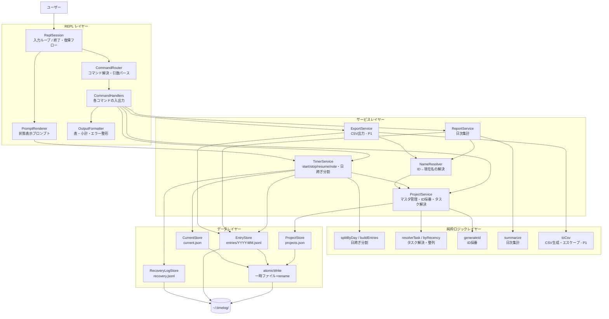
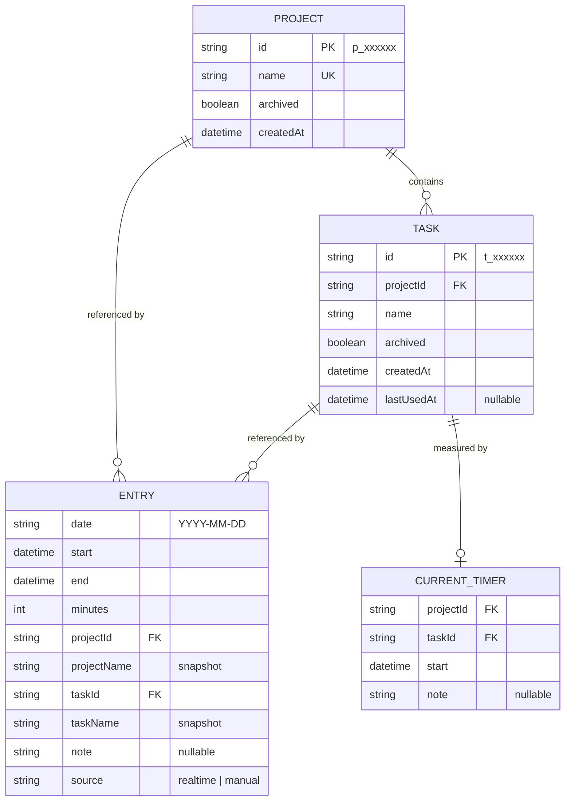
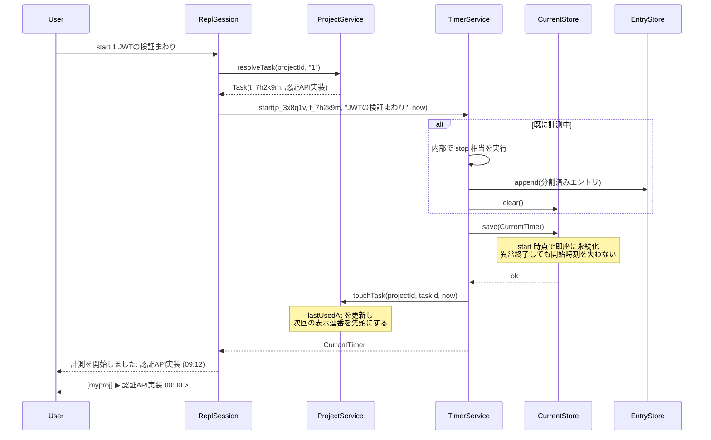
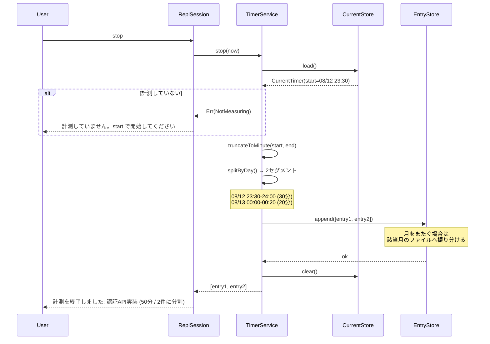
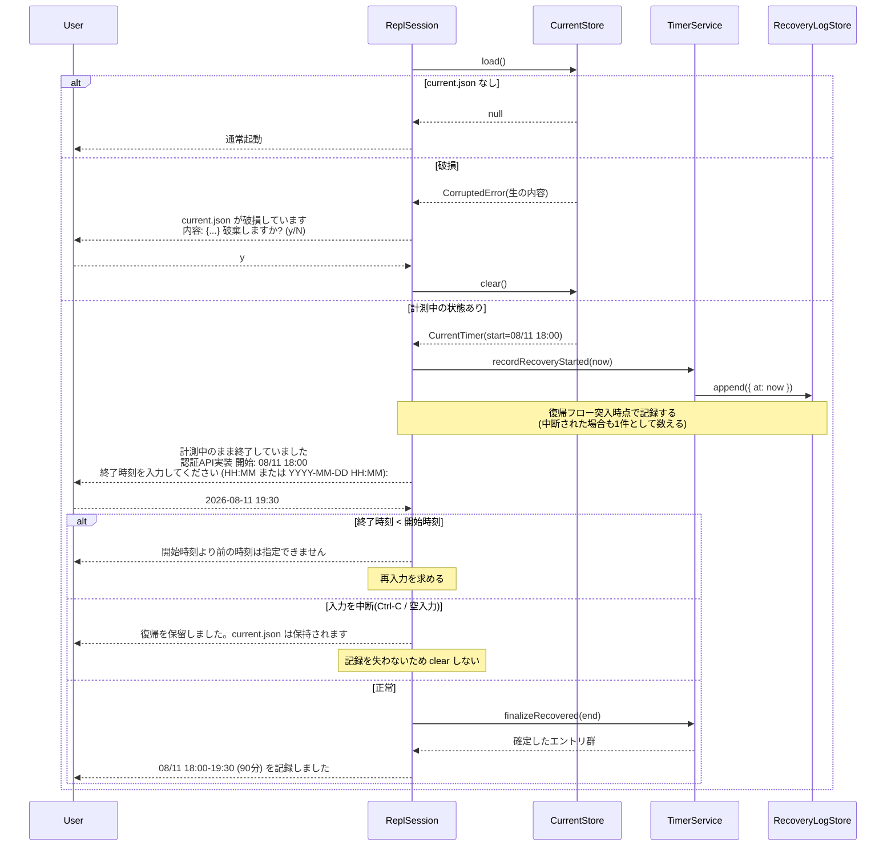
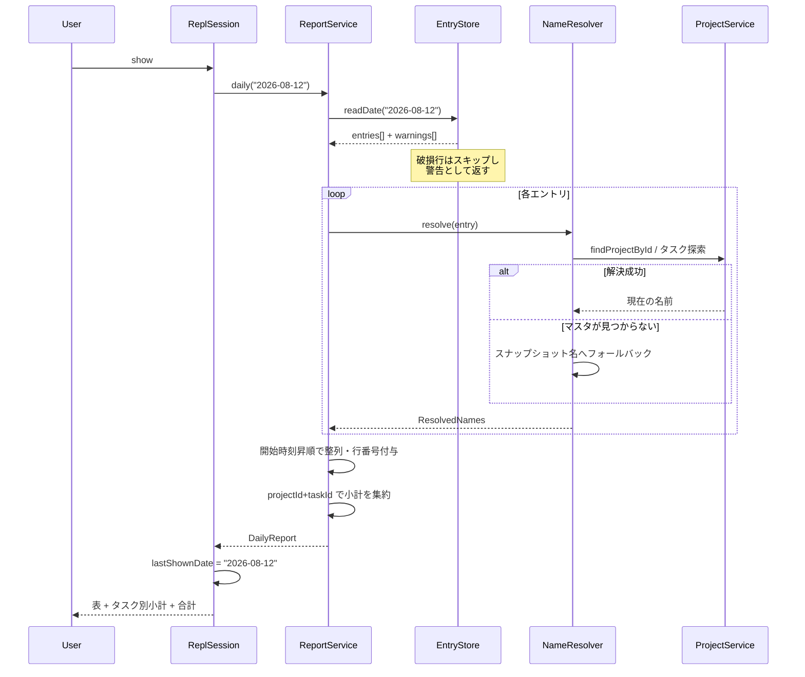
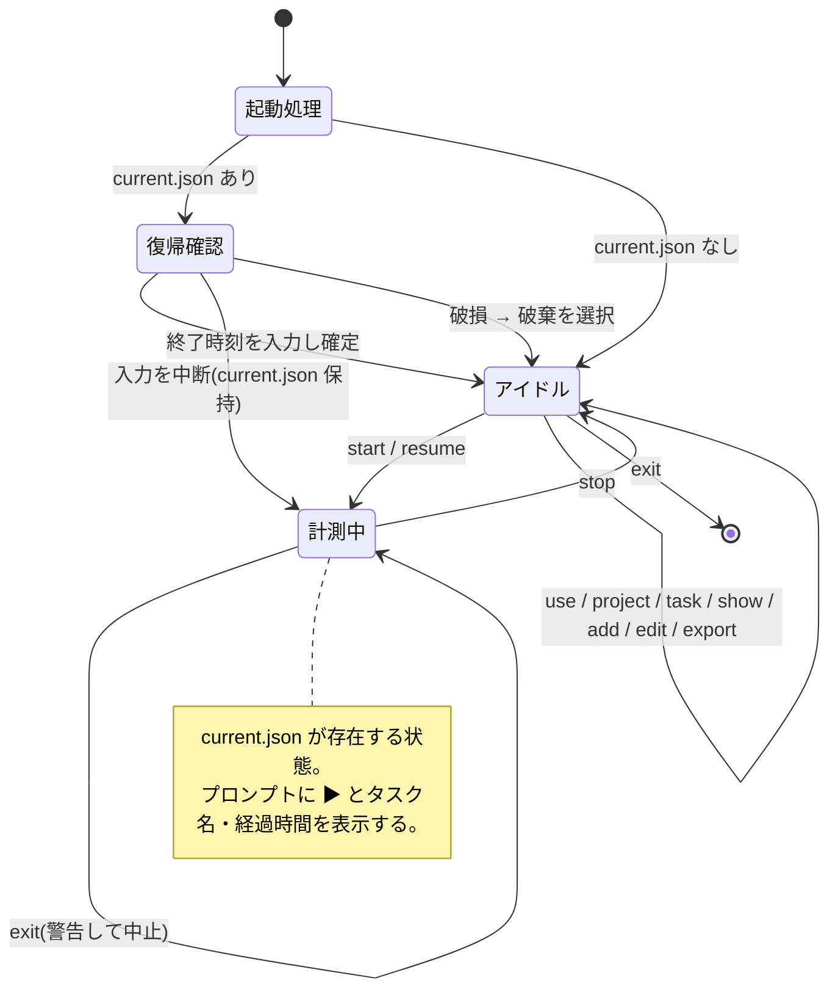

# 機能設計書 (Functional Design Document)

作成日: 2026-08-12
対象: `docs/product-requirements.md`（承認済み）
スコープ: P0(MVP) を中心に設計し、P1 機能は拡張点として構造のみ確保する

## システム構成図



**レイヤーの依存方向は一方向**（REPL → サービス → 純粋ロジック / データ）。サービスレイヤーは
`console` や `readline` に依存せず、戻り値として結果オブジェクトを返す。
これにより、サービス層は REPL を起動せずに単体テストできる。

`splitByDay`・`resolveTask`・`byRecency`・`generateId`・`summarize`・`toCsv` などの
副作用を持たない計算は純粋ロジックレイヤー（`src/domain/`）に切り出し、サービスレイヤーが
これを呼び出す。純粋ロジックはファイルI/O・現在時刻取得・コンソール出力を一切行わないため、
ファイルシステムや時刻のモックなしに単体テストできる（配置は `docs/repository-structure.md` の
`src/domain/` を参照）。

## 技術スタック

| 分類 | 技術 | 選定理由 |
|------|------|----------|
| 言語 | TypeScript 5.3 | データモデルを型で固定する。エントリのID/名前二重保持のような構造は型がないと崩れやすい |
| ランタイム | Node.js v24.19.0 (ESM) | 既存の devcontainer 環境に合わせる。`package.json` は `"type": "module"` 済み |
| REPL | `node:readline/promises` (標準) | 非機能要件「起動 500ms 以内」に対し、外部依存を持たないことが最も確実。プロンプト文字列の動的差し替えにも対応できる |
| コマンド解析 | 自前実装 | コマンド体系が REPL 内の独自文法（`start 3 備考テキスト` のように末尾を自由テキストとして扱う）であり、Commander 等の CLI パーサとは適合しない |
| 永続化 | `node:fs/promises` + JSON / JSONL | ローカル完結・単一ユーザーのため DB は過剰。JSONL は追記が O(1) で、`grep` 可能という PRD の要件にも合う |
| ID採番 | `node:crypto` + Crockford Base32 | 依存追加なしで衝突しない短いIDを生成できる |
| テスト | Vitest 2.x | 既存構成をそのまま使用 |
| 静的解析 | ESLint 9 + Prettier 3 | 既存構成をそのまま使用 |

> **Node.js のバージョン表記について**: 主表記は devcontainer の実測値 v24.19.0 とし、`docs/architecture.md` と揃える。
> `CLAUDE.md` には v24.11.0 と記載があるが、いずれも v24 系のため本設計に影響はない。
> `package.json` の `engines` には `">=24.0.0"` を指定する。

**外部依存を追加しない方針**とする。カラー出力も ANSI エスケープを直接扱う薄いラッパで済ませる。

## データモデル定義

### 型エイリアス

```typescript
/** "p_" + Crockford Base32 6文字 (例: "p_3x8q1v") */
type ProjectId = string;

/** "t_" + Crockford Base32 6文字 (例: "t_7h2k9m") */
type TaskId = string;

/** ローカル日付 "YYYY-MM-DD" */
type DateString = string;

/** ローカルタイムゾーンのオフセット付き ISO 8601 (例: "2026-08-12T09:12:00+09:00") */
type IsoDateTime = string;

/** 月キー "YYYY-MM" */
type MonthKey = string;
```

### エンティティ: Project / Task（マスタ）

```typescript
interface ProjectsFile {
  version: 1;              // スキーマバージョン。将来の移行判定に使う
  projects: Project[];
}

interface Project {
  id: ProjectId;           // 不変。採番後に変化しない
  name: string;            // 1-100文字。全プロジェクト内で一意(アーカイブ済みを含む)
  archived: boolean;       // アーカイブ状態
  createdAt: IsoDateTime;  // 登録日時
  tasks: Task[];           // 配下タスク
}

interface Task {
  id: TaskId;                    // 不変。採番後に変化しない
  name: string;                  // 1-100文字。同一プロジェクト内で一意(アーカイブ済みを含む)
  archived: boolean;             // アーカイブ状態
  createdAt: IsoDateTime;        // 登録日時
  lastUsedAt: IsoDateTime | null; // 最後に計測を開始した日時。「最近使った順」の並び替えキー
}
```

**制約**:

- `id` は採番後に一切変更されない。リネーム・アーカイブ・マスタ再編集の影響を受けない
- `name` の一意性判定はアーカイブ済みを**含めて**行う。アーカイブしたタスクと同名のタスクを再登録すると、過去エントリの表示名が新旧で区別できなくなるため
- `tasks` は `Project` に内包する。プロジェクトを跨いだタスクの共有は行わない（PRD スコープ外）
- `lastUsedAt` は `start` 成功時にのみ更新する。`add`（事後入力・P1）では更新しない。事後入力は「思い出しての補正」であり、直近の作業順序を表さないため

### エンティティ: Entry（実績エントリ）

```typescript
interface Entry {
  date: DateString;        // ローカル日付。start と同じ日を指す
  start: IsoDateTime;      // 開始時刻(秒精度)
  end: IsoDateTime;        // 終了時刻(秒精度)
  minutes: number;         // 作業時間(分)。0以上の整数
  projectId: ProjectId;    // 参照の正
  projectName: string;     // 記録時点のスナップショット
  taskId: TaskId;          // 参照の正
  taskName: string;        // 記録時点のスナップショット
  note?: string;           // 備考。設定された場合のみ存在する
  source: 'realtime' | 'manual';  // 作成経路。start/stop 由来は 'realtime'、
                                  // add/edit(P1) 由来は 'manual'。
                                  // PRD の KPI「事後修正率」の集計に用いる
}
```

**制約**:

- `date` は `start` から導出され、日跨ぎ分割後は各セグメントの開始日と一致する
- `minutes` は「分に切り捨てた開始時刻」と「分に切り捨てた終了時刻」の差から算出する（後述の[作業時間の算出と日跨ぎ分割](#アルゴリズム設計)を参照）
- `note` は空文字列では保存しない。未設定の場合はキー自体を持たない
- `source` は `start` / `stop`（起動時の復帰による確定を含む）で生成された場合は `'realtime'`、`add` / `edit`（P1）で生成・書き換えされた場合は `'manual'` を設定する。P0 の段階から付与しておくことで、P1 導入後に KPI「事後修正率」の分母（全エントリ）を P0 期間まで遡って集計できる。後から追加すると P0 期間のエントリが経路不明となり、遡及集計が不可能になる
- **ID と名前を併せ持つ**。ID は参照の正、名前は `projects.json` を失った場合のフォールバックかつ JSONL 単体での可読性の担保

### エンティティ: CurrentTimer（計測中の状態）

```typescript
interface CurrentTimer {
  version: 1;
  projectId: ProjectId;
  projectName: string;
  taskId: TaskId;
  taskName: string;
  start: IsoDateTime;   // 計測開始時刻
  note?: string;        // note コマンドで設定された備考(上書き)
}
```

**制約**:

- `start` の実行時点で即座にファイルへ書き出す。REPL の異常終了後もこのファイルから計測を復元する
- `note` は上書きのみ。追記はしない（PRD 決定事項）
- 存在しない = 計測していない、を意味する。`stop` 完了時に削除する

### セッション状態（メモリ上のみ・永続化しない）

```typescript
interface SessionState {
  currentProjectId: ProjectId | null;  // use で切り替えた作業対象
  lastShownDate: DateString | null;    // 直前に show が表示した日付。edit の既定対象(P1)
}
```

`resume` の対象は**セッション状態ではなく `EntryStore` の最新確定エントリから解決する**。
これにより REPL を再起動した直後でも `resume` が機能する。

### ER図



`ENTRY` は物理的な外部キー制約を持たない（JSONL のため）。参照の整合性はアプリケーション側で担保し、
解決に失敗した場合はスナップショット名へフォールバックする。

## コンポーネント設計

### ReplSession（REPL レイヤー）

**責務**:

- 起動シーケンス（データディレクトリ生成 → マスタ読み込み → 復帰フロー）の実行
- 入力ループの維持と、1 行ごとの `CommandRouter` への委譲
- 終了フロー（計測中は終了を中止して `stop` を促す）の制御
- 予期しない例外を捕捉し、ループを継続させる

**インターフェース**:

```typescript
class ReplSession {
  constructor(deps: {
    projectService: ProjectService;
    timerService: TimerService;
    reportService: ReportService;
    exportService: ExportService;
    io: ReplIo;                    // readline のラッパ。テスト時は差し替える
  });

  /** 起動から終了までを実行する */
  run(): Promise<void>;

  /**
   * 起動時の復帰フロー。current.json があれば終了時刻を尋ねて確定する。
   * 突入時点で TimerService.recordRecoveryStarted() を呼び、発火を1件記録する。
   * フロー本体は src/repl/recoverTimer.ts に持ち、本メソッドはそこへ委譲する
   * (run() における呼び出し順序の制御だけが ReplSession の責務)
   */
  private recoverIfNeeded(): Promise<void>;

  /** 終了要求の処理。計測中なら false を返してループを継続する */
  private handleExit(): Promise<boolean>;
}

interface ReplIo {
  question(prompt: string): Promise<string>;  // 1行入力
  write(text: string): void;
  onSigint(handler: () => void): void;
}
```

**依存関係**: 各サービス、`ReplIo`、`PromptRenderer`、`CommandRouter`

`ReplIo` を挟むことで、E2E テストで `readline` を使わずにシナリオを流せる。

### PromptRenderer（REPL レイヤー）

**責務**: 現在のセッション状態と計測状態からプロンプト文字列を組み立てる

**インターフェース**:

```typescript
class PromptRenderer {
  /**
   * 計測中:   "[myproj] ▶ 認証API実装 00:23 > "
   * 計測なし: "[myproj] > "
   * 未選択:   "[未選択] > "
   */
  render(state: SessionState, timer: CurrentTimer | null, now: Date): string;
}
```

**設計上の要点**:

- 経過時間はコマンド確定のたびに `now` から再計算する。タイマーによる定期再描画は行わない（PRD の要件は「実際の経過時間との誤差 1 分以内」であり、再描画のたびに正確な値になれば満たせる）
- **これはアイドル時 CPU 0% とのトレードオフである**。REPL に常駐させる利用形態では、何も入力せずに放置している間、プロンプトには最後にコマンドを実行した時点の経過時間が表示され続ける。定期再描画を行えば表示は常に最新になるが、常駐プロセスが 1 分ごとに起床することになり、「起動しっぱなしにしても邪魔にならない」という PRD のコンセプトと引き換えになる。**表示の鮮度より常駐コストを優先する**という判断であり、要件上の誤差 1 分以内は「利用者が経過時間を読むのはコマンドを打った直後である」という前提のもとで満たされる
- `HH:MM` 形式は 100 時間以上でも桁を伸ばす（`String(hours).padStart(2, '0')` により `100:00` となる）
- `now` を引数で受け取り、テスト時に時刻を固定できるようにする

### CommandRouter / CommandHandlers（REPL レイヤー）

**責務**:

- 入力行をコマンド名と引数に分解する
- コマンド名を解決し、未知のコマンドはエラーとして扱う
- ハンドラの結果を `OutputFormatter` に渡して表示する

**インターフェース**:

```typescript
interface ParsedCommand {
  name: string;        // "start" | "project" | ...
  sub?: string;        // "add" | "list" | "archive"（project / task のみ）
  args: string[];      // 分割済み引数
  rest: string;        // 残りをそのまま連結した文字列(備考など自由テキスト用)
  flags: Record<string, string | boolean>;  // --out, --stdout, --bom, --all
}

class CommandRouter {
  parse(line: string): ParsedCommand | ParseError;
  dispatch(cmd: ParsedCommand, ctx: CommandContext): Promise<CommandResult>;
}
```

**引数解析の規則**:

- 空白区切りで分割するが、**引用符で囲まれた部分は 1 トークンとして扱う**（`task add "認証 API 実装"`）
- `start <番号|名前> [備考]` の備考は、第 2 トークン以降を空白を保ったまま連結した `rest` を用いる
- `--` で始まるトークンはフラグとして抽出し、位置引数から除外する

### HelpHandler（REPL レイヤー）

**責務**:

- `help` 実行時、全コマンドの一覧と 1 行説明を表示する
- `help <コマンド名>` 実行時、該当コマンドの引数説明と使用例を表示する
- 未知のコマンド入力時、`CommandRouter` から参照され、エラーメッセージに `help` の案内を付与する（[エラーハンドリング](#エラーハンドリング)の「未知のコマンド」はこの経路で表示する）

**インターフェース**:

```typescript
interface CommandSpec {
  name: string;             // "start" | "project" | ...
  sub?: string;             // "add" | "list" | "archive"（project / task のみ）
  summary: string;          // 1行説明。help の一覧表示に使う
  usage: string;            // "start <番号|名前> [備考]" 形式
  examples: string[];       // help <コマンド名> で表示する使用例
}

/**
 * CommandRouter が dispatch 可能な全コマンドの静的定義。
 * コマンド一覧の唯一の情報源とする
 */
const COMMAND_SPECS: CommandSpec[] = [
  { name: 'project', sub: 'add', summary: 'プロジェクトを登録する', usage: 'project add <名前>', examples: ['project add myproj'] },
  { name: 'use', summary: '作業対象プロジェクトを切り替える', usage: 'use <プロジェクト>', examples: ['use myproj'] },
  { name: 'start', summary: '計測を開始する', usage: 'start <番号|名前> [備考]', examples: ['start 1', 'start 認証API 実装続き'] },
  { name: 'stop', summary: '計測を終了してエントリを確定する', usage: 'stop', examples: ['stop'] },
  { name: 'show', summary: '1日の作業実績とタスク別小計を表示する', usage: 'show [YYYY-MM-DD]', examples: ['show', 'show 2026-08-12'] },
  // ... 以下、PRD のコマンド体系に定義された全コマンドを列挙する
];

class HelpHandler {
  /** help: 全コマンドの一覧と1行説明を返す */
  listAll(): string;

  /** help <コマンド名>: 該当コマンドの詳細を返す。未知の名前は NotFound を返す */
  describe(commandName: string): Result<string, { kind: 'NotFound'; input: string }>;
}
```

**設計上の要点**:

- `COMMAND_SPECS` は `CommandRouter` のディスパッチテーブルと同一のソースファイルで管理し、そこから両者を導出する。説明文とディスパッチ先を別々に持つと、コマンド追加時に `help` の更新漏れが生じ、PRD の受け入れ条件「`help` のみで全コマンドの仕様を確認でき、外部ドキュメントを参照する必要がない」を満たせなくなる
- `describe` は例外を投げず `Result` で失敗を返す。他のハンドラと同じエラー表現に揃え、REPL のループを中断させない
- `sub` を持つコマンド（`project` / `task`）は、`help project` でサブコマンドをまとめて表示する

### ProjectService（サービスレイヤー）

**責務**:

- プロジェクト・タスクの登録、一覧、アーカイブ
- 不変IDの採番と衝突回避
- タスク指定（番号 / 名前部分一致）の解決
- `lastUsedAt` の更新

**インターフェース**:

```typescript
class ProjectService {
  addProject(name: string): Promise<Result<Project>>;
  listProjects(includeArchived: boolean): Promise<Project[]>;
  archiveProject(name: string): Promise<Result<Project>>;
  findProjectById(projectId: ProjectId): Promise<Project | null>;
  findProjectByName(name: string): Promise<Project | null>;

  addTask(projectId: ProjectId, name: string): Promise<Result<Task>>;
  /** 最近使った順に整列した非アーカイブタスク。表示連番はこの配列の添字+1 */
  listTasks(projectId: ProjectId, includeArchived: boolean): Promise<Task[]>;
  archiveTask(projectId: ProjectId, taskId: TaskId): Promise<Result<Task>>;

  /** 番号または名前部分一致でタスクを解決する */
  resolveTask(projectId: ProjectId, input: string): Promise<Result<Task, ResolveError>>;

  /** start 成功時に呼ばれ、並び順を更新する */
  touchTask(projectId: ProjectId, taskId: TaskId, at: Date): Promise<void>;
}

type ResolveError =
  | { kind: 'IndexOutOfRange'; input: string; max: number }
  | { kind: 'NotFound'; input: string }
  | { kind: 'Ambiguous'; input: string; candidates: Task[] };
```

**依存関係**: `ProjectStore`

**設計上の要点**: `projects.json` は起動時に一度読み込んでメモリに保持し、変更時のみ書き戻す。
非機能要件のコマンド応答 100ms を満たすため、`list` / `resolve` でファイル I/O を発生させない。

### TimerService（サービスレイヤー）

**責務**:

- 計測の開始・終了・再開・備考設定
- 日跨ぎ分割の適用とエントリ生成
- `current.json` のライフサイクル管理
- 復帰導線の発火記録（KPI 測定用。`current.json` のライフサイクルに付随する事象のため、本サービスが担う）

**インターフェース**:

```typescript
class TimerService {
  getCurrent(): Promise<CurrentTimer | null>;

  /** 計測中の場合は自動で stop してから開始する */
  start(projectId: ProjectId, taskId: TaskId, note: string | undefined, now: Date)
    : Promise<Result<{ started: CurrentTimer; autoStopped?: Entry[] }>>;

  /** 計測を終了し、日跨ぎ分割後のエントリ群を返す */
  stop(now: Date): Promise<Result<Entry[]>>;

  /**
   * 直前に確定したエントリと同じタスクで開始する。
   * 引き継ぐのはタスクのみで、**備考は引き継がない**（同じ作業の続きでも
   * 内容は変わるため。必要なら `note` で改めて設定する）
   */
  resume(now: Date): Promise<Result<CurrentTimer>>;

  /** 計測中エントリの備考を上書きする */
  setNote(text: string): Promise<Result<CurrentTimer>>;

  /** 復帰フロー用。指定した終了時刻で計測を確定する */
  finalizeRecovered(end: Date): Promise<Result<Entry[]>>;

  /**
   * 復帰フロー用。復帰導線が発火したことを記録する(KPI 測定)。
   * 確定の成否に関わらず、フロー突入時に1度だけ呼ぶ
   */
  recordRecoveryStarted(now: Date): Promise<void>;

  // --- 以下 P1 ---

  /**
   * 事後入力。計測を経ずにエントリを直接作成する。
   * 日跨ぎ分割は buildEntries を source='manual' で再利用する
   */
  add(params: AddParams): Promise<Result<{ entries: Entry[]; warnings: string[] }>>;

  /**
   * 事後修正の対象を取得する。実行前の確認表示に用いる
   * (PRD: 修正実行前に対象エントリの現在の内容を表示して確認を求める)
   */
  findForEdit(date: DateString, lineNo: number): Promise<Result<Entry>>;

  /**
   * 事後修正。指定日の表示連番で対象を特定し、1 フィールドを書き換える。
   * 該当月の全置換(EntryStore.rewriteMonth)を伴うため、
   * 戻り値は書き換え後の「当日の」エントリ群とする
   */
  edit(date: DateString, lineNo: number, field: EditableField, value: string)
    : Promise<Result<{ entries: Entry[]; warnings: string[] }>>;
}

/** add の入力。date 省略時は start の日付を用いる */
interface AddParams {
  date?: DateString;
  start: IsoDateTime;
  end: IsoDateTime;
  projectId: ProjectId;
  taskId: TaskId;
  note?: string;
}

/** edit で書き換え可能なフィールド。`task` は同一プロジェクト内のタスク付け替え */
type EditableField = 'start' | 'end' | 'task' | 'note';
```

**`add` / `edit` の設計上の要点**:

- `add` / `edit` で生成・書き換えするエントリは `source: 'manual'` とする。KPI「事後修正率」の集計対象になる（[Entry の制約](#エンティティ-entry実績エントリ)を参照）
- 時間帯が既存エントリと重なる場合も**中断せず実行**し、`warnings` に載せて呼び出し側に警告表示させる。会議中に別作業をしていた等、重複が実態として正しいケースがあるため
- `lineNo` は `show` が表示する表示連番であり、ファイル上の行番号ではない。利用者が画面で見た番号をそのまま打てるようにする。**対象日の既定値は「直前に `show` で表示した日付」**（未実行なら当日）であり、この状態は REPL レイヤーが保持してサービスには解決済みの `date` を渡す
- `field` に `task` を指定した場合、同一プロジェクト内でのみ付け替える。付け替え時は `projectId` / `taskId` と、スナップショットである `projectName` / `taskName` を必ず同時に書き換える。片方だけの更新は[エントリの ID と名前の二重保持](#エンティティ-entry実績エントリ)を静かに壊す
- `start` / `end` の修正で日付をまたぐことになった場合、`buildEntries` による日跨ぎ分割を再適用する。この場合 1 件のエントリが複数件に増えるため、`edit` の戻り値は単一エントリではなくエントリ群とする
- 本プロダクトは**エントリの削除コマンドを持たない**（PRD のスコープ外判断）。誤記録の是正はすべて `edit` による書き換えで行う

**依存関係**: `CurrentStore`、`EntryStore`、`RecoveryLogStore`、`ProjectService`

### ReportService（サービスレイヤー）

**責務**: 指定日のエントリ取得、行番号付与、タスク別小計と合計の算出

**インターフェース**:

```typescript
interface DailyReport {
  date: DateString;
  rows: ReportRow[];          // 開始時刻の昇順。lineNo は 1 始まり
  subtotals: Subtotal[];      // プロジェクト+タスク単位。合計時間の降順
  totalMinutes: number;
}

interface ReportRow {
  lineNo: number;
  entry: Entry;
  projectName: string;   // ID から解決した現在名
  taskName: string;      // ID から解決した現在名
  resolvedFromSnapshot: boolean;  // フォールバックした場合 true
}

interface Subtotal {
  projectName: string;
  taskName: string;
  minutes: number;
}

class ReportService {
  daily(date: DateString): Promise<DailyReport>;
}
```

**依存関係**: `EntryStore`、`NameResolver`

### NameResolver（サービスレイヤー）

**責務**: エントリの ID から現在のプロジェクト名 / タスク名を解決し、失敗時はスナップショットへフォールバックする

**インターフェース**:

```typescript
interface ResolvedNames {
  projectName: string;
  taskName: string;
  fromSnapshot: boolean;   // true の場合、呼び出し側は警告を表示する
}

class NameResolver {
  resolve(entry: Entry): Promise<ResolvedNames>;
}
```

**設計上の要点**: この 1 箇所に解決規則を集約する。`show` と `export` が同じ表示名を返すことを、
コンポーネントの単一性によって保証する。

### ExportService（サービスレイヤー・P1）

**責務**: 月次エントリの CSV 化、RFC 4180 準拠のエスケープ、BOM 付与

```typescript
interface ExportOptions {
  month: MonthKey;
  withBom: boolean;
  withId: boolean;      // P2。既定 false
}

class ExportService {
  /** CSV 文字列を生成する。ファイル書き出し・標準出力の選択は呼び出し側の責務 */
  toCsv(options: ExportOptions): Promise<string>;
}
```

### 純粋ロジックレイヤー (domain)

**責務**: 副作用（ファイルI/O・現在時刻の取得・コンソール出力）を持たない計算のみを行う。
サービスレイヤーから呼び出される。

| 関数 | 役割 | 呼び出し元 |
|------|------|-----------|
| `splitByDay` / `buildEntries` / `truncateToMinute` | 日跨ぎ分割と Entry の生成（分切り捨てを含む） | `TimerService` |
| `resolveTask` / `byRecency` | 番号・名前部分一致によるタスク解決、「最近使った順」の整列 | `ProjectService` |
| `generateId` | Crockford Base32 による不変IDの採番 | `ProjectService` |
| `summarize` | 日次集計（行番号付与・タスク別小計） | `ReportService` |
| `toCsv`（P1） | CSV 文字列の生成と RFC 4180 準拠のエスケープ | `ExportService` |

**依存関係**: `types/` のみ。`stores/`・`services/`・`repl/` への依存は禁止する。

**設計上の要点**:

- 現在時刻は引数として受け取る。`Date.now()` を内部で呼ばないため、時刻のモックなしに単体テストできる
- 各ファイルは 1 エクスポート関数を原則とする（配置とファイル名は `docs/repository-structure.md` の `src/domain/` を正とする）

### データレイヤー

```typescript
class ProjectStore {
  load(): Promise<ProjectsFile>;          // 存在しない場合は空の初期値を返す
  save(data: ProjectsFile): Promise<void>; // atomicWrite 経由
}

class CurrentStore {
  load(): Promise<CurrentTimer | null>;   // 破損時は CorruptedError を投げる
  save(timer: CurrentTimer): Promise<void>;
  clear(): Promise<void>;
}

class EntryStore {
  /** 該当月を読み込む。破損行はスキップし、警告を warnings に積む */
  readMonth(month: MonthKey): Promise<{ entries: Entry[]; warnings: string[] }>;
  readDate(date: DateString): Promise<{ entries: Entry[]; warnings: string[] }>;
  /** 最新の確定エントリ(resume 用) */
  readLatest(): Promise<Entry | null>;
  /** 複数エントリを月ごとに振り分けて追記する */
  append(entries: Entry[]): Promise<void>;
  /** 該当月を全置換する(edit 用・P1)。atomicWrite 経由 */
  rewriteMonth(month: MonthKey, entries: Entry[]): Promise<void>;
}

/** 復帰処理の発動記録。作業内容(タスク名・備考・プロジェクト名)は一切含まない */
interface RecoveryEvent {
  at: IsoDateTime;   // 復帰処理が発動した日時のみ
}

class RecoveryLogStore {
  /** 起動時、current.json が存在し復帰フローに入った時点で1行追記する */
  append(event: RecoveryEvent): Promise<void>;
  /** 月次集計用。指定月の発生回数を数える */
  countInMonth(month: MonthKey): Promise<number>;
}

/** 一時ファイルへ書き出してから rename する。処理中の異常終了でも既存ファイルが壊れない */
function atomicWrite(path: string, content: string, mode: number): Promise<void>;
```

**`RecoveryLogStore` の設計上の要点**:

- PRD の KPI「復帰導線の発火率（月 1 回以下）」を測定するための記録である。`architecture.md` のログ非出力方針は「作業内容（タスク名・備考）を含むため」を理由とするものであり、タイムスタンプのみを持つこの記録は対象外とする。**将来もフィールドを増やさない**こと。増やした時点でこの前提が崩れる
- 記録するのは復帰フローに**突入した時点**であり、ユーザーが確定をキャンセルした場合も 1 件として数える。KPI が測るのは確定の成否ではなく異常終了の頻度であるため
- `append` の失敗は復帰フローを中断させない。KPI 計測用の副次的な記録が、ユーザーのデータ確定を妨げてはならない

**`append` が追記（`appendFile`）を使う理由**: `stop` は最も頻度が高く、かつ最も失ってはいけない操作である。
追記は既存の行に一切触れないため、途中で中断しても過去のエントリを破壊しない。
一方 `rewriteMonth` は既存行を書き換えるため `atomicWrite` を用いる。

## アルゴリズム設計

### 作業時間の算出と日跨ぎ分割

**目的**: 計測区間を日付境界で分割し、分割後の作業時間の合計が分割前と厳密に一致することを保証する

#### 課題

各セグメントの作業時間を独立に「秒切り捨て」で算出すると、切り捨て誤差が segment 数だけ累積し、
合計が分割前と最大で (セグメント数 − 1) 分ずれる。PRD の受け入れ条件
「分割によって生成された各エントリの作業時間の合計が、分割前の総作業時間と一致する」を満たせない。

#### 解決方針

**分割の前に開始時刻・終了時刻を分単位へ切り捨てる**。日付境界（00:00:00）は常に分の倍数であるため、
分単位に揃った区間を分単位の境界で割る限り、各セグメントは必ず整数分となり、合計は厳密に一致する。

記録される `start` / `end` は秒精度のまま保持し、`minutes` の算出にのみ切り捨て後の値を使う。

#### ステップ1: 分単位への切り捨て

```typescript
function truncateToMinute(d: Date): Date {
  const t = new Date(d);
  t.setSeconds(0, 0);
  return t;
}
```

#### ステップ2: 日付境界での分割

```typescript
interface Segment { start: Date; end: Date; }

function splitByDay(start: Date, end: Date): Segment[] {
  const segments: Segment[] = [];
  let cursor = start;

  while (cursor < end) {
    const nextMidnight = startOfNextDay(cursor);   // ローカルタイムの翌日 00:00:00
    const segEnd = nextMidnight < end ? nextMidnight : end;
    segments.push({ start: cursor, end: segEnd });
    cursor = segEnd;
  }

  // start === end(0分)の場合、ループが1度も回らないため単一セグメントを返す
  return segments.length > 0 ? segments : [{ start, end }];
}

function startOfNextDay(d: Date): Date {
  const t = new Date(d);
  t.setDate(t.getDate() + 1);
  t.setHours(0, 0, 0, 0);
  return t;
}
```

**分割回数に上限を設けない**。金曜夜から月曜朝まで `stop` を押し忘れた場合、
3 セグメントに分割される。境界の数え方を特別扱いしないことで、この分岐を実装から消している。

`startOfNextDay` は `setDate` / `setHours` を使うため、夏時間の切り替わりがある地域でも
「その日の翌日の 0 時」を正しく求められる。

#### ステップ3: エントリ生成

```typescript
function buildEntries(
  rawStart: Date, rawEnd: Date, timer: CurrentTimer,
  source: Entry['source'] = 'realtime',   // add(P1) は 'manual' を渡して再利用する
): Entry[] {
  const start = truncateToMinute(rawStart);
  const end = truncateToMinute(rawEnd);

  return splitByDay(start, end).map((seg) => ({
    date: formatDate(seg.start),                      // "YYYY-MM-DD"
    start: formatIsoLocal(seg.start),
    end: formatIsoLocal(seg.end),
    minutes: (seg.end.getTime() - seg.start.getTime()) / 60_000,
    projectId: timer.projectId,
    projectName: timer.projectName,
    taskId: timer.taskId,
    taskName: timer.taskName,
    ...(timer.note ? { note: timer.note } : {}),
    source,
  }));
}
```

**備考の扱い**: 分割で生成された全エントリに同じ備考を複製する。
分割は利用者が意図した行分けではないため、どのセグメントにも文脈が必要である。

**時刻フォーマット**: `Date#toISOString()` は UTC の `Z` 形式を返すため使えない。
ローカルオフセット付き ISO 8601 を生成する `formatIsoLocal` を自前で実装する
（`getTimezoneOffset()` から `+09:00` 形式を組み立てる）。

#### 検証（合計一致の保証）

| ケース | 入力 | 分割結果 | 合計 |
|--------|------|----------|------|
| 日跨ぎなし | 09:12:30 → 10:17:45 | 1 件 (09:12→10:17) | 65 分 = 元の 65 分 ✓ |
| 1 回分割 | 08/12 23:30 → 08/13 00:20 | 2 件 (30 分 + 20 分) | 50 分 = 元の 50 分 ✓ |
| 3 日跨ぎ | 08/14 18:00 → 08/17 09:00 | 4 件 (360 + 1440 + 1440 + 540) | 3780 分 = 元の 3780 分 ✓ |
| 0 分 | 09:00:10 → 09:00:50 | 1 件 (0 分) | 0 分（破棄しない） ✓ |

### タスク指定の解決

**目的**: 数字なら表示連番、文字列なら名前の部分一致として解釈し、曖昧な場合は候補を提示する

```typescript
async function resolveTask(
  projectId: ProjectId, input: string
): Promise<Result<Task, ResolveError>> {
  const active = await listTasks(projectId, false);  // 最近使った順・非アーカイブのみ

  // 数字のみ → 表示連番
  if (/^\d+$/.test(input)) {
    const index = Number(input) - 1;
    if (index < 0 || index >= active.length) {
      return err({ kind: 'IndexOutOfRange', input, max: active.length });
    }
    return ok(active[index]);
  }

  // それ以外 → 部分一致
  const matches = active.filter((t) => t.name.includes(input));
  if (matches.length === 0) return err({ kind: 'NotFound', input });
  if (matches.length > 1) return err({ kind: 'Ambiguous', input, candidates: matches });
  return ok(matches[0]);
}
```

**「最近使った順」の並び替え規則**:

```typescript
function byRecency(a: Task, b: Task): number {
  // 1. lastUsedAt の降順(未使用は最後)
  if (a.lastUsedAt !== b.lastUsedAt) {
    if (a.lastUsedAt === null) return 1;
    if (b.lastUsedAt === null) return -1;
    return b.lastUsedAt.localeCompare(a.lastUsedAt);
  }
  // 2. 同値なら登録日時の降順(新しいものを手前に)
  return b.createdAt.localeCompare(a.createdAt);
}
```

**表示連番と `resolveTask` が同じ配列から導出される**ことが重要である。
`task list` の表示と `start <番号>` の解決で別々に整列すると、両者がずれた瞬間に誤ったタスクを計測してしまう。
`listTasks` を唯一の整列点とすることで、PRD の受け入れ条件
「番号の並び順は `task list` の表示順と常に一致する」を構造的に満たす。

**ID による指定は MVP では受け付けない**。ただし ID が `t_` 始まりで数字始まりにならないため、
将来 `input.startsWith('t_')` の分岐を先頭に足すだけで、既存の 2 分岐と衝突せずに拡張できる。

### ID の採番

**目的**: 短く、数字始まりにならず、既存 ID と衝突しない不変 ID を生成する

```typescript
const ALPHABET = '0123456789abcdefghjkmnpqrstvwxyz';  // Crockford Base32 (i, l, o, u を除外)

function generateId(prefix: 'p' | 't', existing: Set<string>): string {
  for (let attempt = 0; attempt < 100; attempt++) {
    const bytes = randomBytes(6);
    const body = Array.from(bytes, (b) => ALPHABET[b % 32]).join('');
    const id = `${prefix}_${body}`;
    if (!existing.has(id)) return id;
  }
  throw new Error('ID の採番に失敗しました');
}
```

- **Crockford Base32** を使うのは、`i`/`l`/`1`、`o`/`0` の見間違いを避けるため。ID を目視で扱う場面（`--with-id` の CSV、JSONL の直接閲覧）がある
- `existing` には**アーカイブ済みを含む全 ID** を渡す。アーカイブしても過去エントリからの参照は生きているため、ID の再利用は許されない
- 32^6 ≈ 10 億通り。想定規模（プロジェクト 100 / タスク 20,000）では衝突は事実上起きないが、生成後の存在チェックで確実に排除する

### 日次集計（タスク別小計）

```typescript
function summarize(entries: Entry[], resolver: NameResolver): DailyReport {
  const rows = entries
    .sort((a, b) => a.start.localeCompare(b.start))
    .map((entry, i) => ({ lineNo: i + 1, entry, ...resolver.resolve(entry) }));

  // プロジェクトID + タスクID をキーに集約する(名前ではなくIDで束ねる)
  const map = new Map<string, Subtotal>();
  for (const row of rows) {
    const key = `${row.entry.projectId}:${row.entry.taskId}`;
    const found = map.get(key);
    if (found) found.minutes += row.entry.minutes;
    else map.set(key, {
      projectName: row.projectName,
      taskName: row.taskName,
      minutes: row.entry.minutes,
    });
  }

  const subtotals = [...map.values()].sort((a, b) => b.minutes - a.minutes);
  const totalMinutes = rows.reduce((sum, r) => sum + r.entry.minutes, 0);
  return { date, rows, subtotals, totalMinutes };
}
```

**集約キーに名前ではなく ID を使う**。名前で束ねると、リネーム前後のエントリや、
スナップショットにフォールバックしたエントリが別行に割れてしまう。
小計の意味は「同じタスクの合計」であり、それは ID で定義される。

### CSV 生成（P1）

```typescript
function escapeCsvField(value: string): string {
  // RFC 4180: , " CR LF のいずれかを含む場合はクォートし、" は "" にエスケープする
  if (/[",\r\n]/.test(value)) {
    return `"${value.replace(/"/g, '""')}"`;
  }
  return value;
}
```

- ヘッダ行は固定 7 列（`--with-id` 指定時のみ 9 列）
- 行は `date` → `start` の昇順
- `note` が未設定の行は**空文字列**を出力する（列は落とさない）
- BOM 付き指定時は先頭に `` を付与する

## ユースケース図

### 計測開始（start）



### 計測終了（日跨ぎを含む stop）



### 異常終了からの復帰（起動時）



### 日次実績の表示（show）



## 状態遷移図

REPL は「計測中かどうか」を軸に状態を持つ。この状態は `current.json` の存在と一致する。



**「復帰確認 → 計測中」の遷移**は、復帰の入力を中断した場合に相当する。
`current.json` を保持したまま REPL に入るため、利用者はそのまま `stop` を打って
現在時刻で閉じることも、再起動して改めて終了時刻を入力することもできる。記録は失われない。

## UI設計

### プロンプト

| 状態 | 表示 |
|------|------|
| 計測中 | `[myproj] ▶ 認証API実装 00:23 > ` |
| 計測なし | `[myproj] > ` |
| プロジェクト未選択 | `[未選択] > ` |

- 経過時間は `HH:MM`。100 時間以上は桁が伸びる（`100:00`）
- タスク名が長い場合は 20 文字で切り詰め、末尾に `…` を付ける（プロンプトが折り返して入力が見づらくなるのを防ぐ）

### `show` のテーブル表示

**表示項目**:

| 項目 | 説明 | フォーマット |
|------|------|-------------|
| # | その日の行番号（`edit` の指定に使う） | 右詰め整数 |
| 開始 | 開始時刻 | `HH:MM` |
| 終了 | 終了時刻 | `HH:MM` |
| 時間 | 作業時間 | `H:MM(N分)` 例: `1:05(65分)` |
| プロジェクト | ID から解決した現在名 | 左詰め |
| タスク | ID から解決した現在名 | 左詰め |
| 備考 | 未設定なら空欄 | 左詰め |

**表示例**:

```
2026-08-12 の作業実績

  #  開始    終了    時間        プロジェクト  タスク          備考
  1  09:12   10:17   1:05(65分)  myproj        認証API実装     リフレッシュトークンの設計も含む
  2  10:30   11:00   0:30(30分)  myproj        定例MTG

  タスク別小計
    myproj / 認証API実装   1:05 (65分)
    myproj / 定例MTG       0:30 (30分)

  合計  1:35 (95分)
```

- 列幅は内容に応じて動的に決める。日本語を含むため、**表示幅は文字数ではなく East Asian Width を考慮した桁数で算出する**（全角 2 桁・半角 1 桁）
- 作業時間を `H:MM` と `N分` の両方で出すのは、PRD の受け入れ条件による。前者は感覚的な把握、後者は表計算への転記に使う

### カラーコーディング

ANSI エスケープを直接使用し、`process.stdout.isTTY` が false の場合は色を付けない。

| 色 | 用途 |
|----|------|
| シアン | プロンプトのプロジェクト名 |
| 緑 | 計測中マーカー `▶`、成功メッセージ |
| 黄 | 警告（スナップショットへのフォールバック、破損行のスキップ、時間帯の重複） |
| 赤 | エラーメッセージ |
| グレー | 表のヘッダ、区切り線 |

## ファイル構造

**データ保存形式**:

```
~/.timelog/                 # パーミッション 700
├── projects.json           # プロジェクト/タスクのマスタ (600)
├── current.json            # 計測中の状態。存在しない = 計測していない (600)
├── recovery.jsonl          # 復帰処理の発動記録。タイムスタンプのみ (600)
└── entries/                # (700)
    ├── 2026-07.jsonl       # 月別・1行1エントリ (600)
    └── 2026-08.jsonl
```

**projects.json の例**:

```json
{
  "version": 1,
  "projects": [
    {
      "id": "p_3x8q1v",
      "name": "myproj",
      "archived": false,
      "createdAt": "2026-08-01T09:00:00+09:00",
      "tasks": [
        {
          "id": "t_7h2k9m",
          "name": "認証API実装",
          "archived": false,
          "createdAt": "2026-08-01T09:01:00+09:00",
          "lastUsedAt": "2026-08-12T09:12:00+09:00"
        },
        {
          "id": "t_2p4n8s",
          "name": "定例MTG",
          "archived": false,
          "createdAt": "2026-08-01T09:02:00+09:00",
          "lastUsedAt": "2026-08-12T10:30:00+09:00"
        }
      ]
    }
  ]
}
```

**entries/2026-08.jsonl の例**（1 行 1 エントリ・整形なし）:

```jsonl
{"date":"2026-08-12","start":"2026-08-12T09:12:00+09:00","end":"2026-08-12T10:17:00+09:00","minutes":65,"projectId":"p_3x8q1v","projectName":"myproj","taskId":"t_7h2k9m","taskName":"認証API実装","note":"リフレッシュトークンの設計も含む","source":"realtime"}
{"date":"2026-08-12","start":"2026-08-12T10:30:00+09:00","end":"2026-08-12T11:00:00+09:00","minutes":30,"projectId":"p_3x8q1v","projectName":"myproj","taskId":"t_2p4n8s","taskName":"定例MTG","source":"realtime"}
```

**current.json の例**:

```json
{
  "version": 1,
  "projectId": "p_3x8q1v",
  "projectName": "myproj",
  "taskId": "t_7h2k9m",
  "taskName": "認証API実装",
  "start": "2026-08-12T09:12:00+09:00",
  "note": "リフレッシュトークンの設計も含む"
}
```

**recovery.jsonl の例**（1 行 1 イベント。作業内容は含まない）:

```jsonl
{"at":"2026-08-13T09:02:00+09:00"}
{"at":"2026-09-04T08:47:00+09:00"}
```

## パフォーマンス最適化

| 施策 | 内容 | 対応する非機能要件 |
|------|------|-------------------|
| マスタのメモリ常駐 | `projects.json` を起動時に一度読み、変更時のみ書き戻す。`list` / `resolveTask` はファイル I/O を行わない | コマンド応答 100ms 以内 |
| 月別ファイル分割 | `show` は該当月のみ、`export` は該当月のみを読む。蓄積量が増えても読み込み対象は一定 | 3 年分の蓄積でも性能が劣化しない |
| 追記による確定 | `stop` は `appendFile` で 1 行追記するのみ。月全体の再書き込みを行わない | `stop` の応答 100ms 以内 |
| 外部依存ゼロ | 標準モジュールのみを使用し、起動時のモジュール解決コストを抑える | 起動 500ms 以内 |
| プロンプトの遅延評価 | 経過時間はコマンド確定時にのみ再計算し、タイマーによる定期再描画を行わない | 再描画による体感遅延なし |
| 並び替えのキャッシュ | `listTasks` の整列結果を、マスタ変更まで再利用する | タスク 200 件でも 100ms 以内 |

## セキュリティ考慮事項

| 考慮事項 | 対策 |
|----------|------|
| 作業内容・顧客名の外部流出 | ネットワーク I/O を実装しない。外部依存パッケージを追加しないことで、間接的な通信経路も持たない |
| 他ユーザーからのデータ閲覧 | ディレクトリを `0o700`、ファイルを `0o600` で作成する。`fs.mkdir` / `fs.writeFile` の `mode` を明示し、`process.umask` に依存しない |
| 書き込み中断によるデータ破損 | 書き換えを伴う操作は `atomicWrite`（一時ファイル + `rename`）で行う。`rename` は同一ファイルシステム内で原子的 |
| 破損データによる起動不能 | JSONL は行単位で復元する。1 行が壊れても他の行は読める。`projects.json` / `current.json` の破損時は内容を提示して復旧を案内する |
| CSV インジェクション | 表計算ソフトで開いた際に `=` `+` `-` `@` 始まりのセルが数式として解釈される問題に対し、備考・タスク名が該当する場合は先頭に `'` を付与してエスケープする |
| パスの不正指定 | `export --out` に渡されたパスはユーザー自身の入力であるため制限しないが、ディレクトリが存在しない場合はエラーとし、意図しない場所への書き出しを防ぐ |

## エラーハンドリング

### エラーの分類

サービスレイヤーは例外を投げず、`Result<T, E>` を返す。REPL レイヤーがそれを表示に変換する。
**すべてのエラーメッセージは「何が問題か」と「次に何をすべきか」の両方を含む**（PRD の非機能要件）。

`kind` 列は `AppError` の判別可能ユニオンのタグ（`glossary.md` の [AppError](glossary.md) と 1 対 1 で対応）。
`—` の行は `AppError` ではなく、警告・確認・REPL レイヤーの制御・ストア層の例外として扱う。

| エラー種別 | `kind` | 発生条件 | 処理 | ユーザーへの表示 |
|-----------|--------|---------|------|-----------------|
| プロジェクト未選択 | `NoProjectSelected` | `task add` / `start` 実行時に `currentProjectId` が null | 中断 | `プロジェクトが選択されていません。'use <プロジェクト名>' で選択してください` |
| プロジェクト不明 | `ProjectNotFound` | `use` に未登録の名前 | 中断・一覧を併記 | `プロジェクト 'foo' は登録されていません。登録済み: myproj, otherproj` |
| 名前の重複 | `DuplicateName` | `project add` / `task add` に既存名 | 中断 | `タスク '認証API実装' は既に登録されています。'task list' で確認してください` |
| 名前が不正 | `InvalidName` | `project add` / `task add` の名前が 1〜100 文字の範囲外、または制御文字を含む | 中断 | `タスク名は 1〜100 文字で指定してください` |
| 連番が範囲外 | `IndexOutOfRange` | `start 99`（タスクが 3 件） | 中断 | `番号 99 は範囲外です。1〜3 の番号か、タスク名の一部を指定してください` |
| 該当タスクなし | `NotFound` | 部分一致 0 件 | 中断 | `'認証' に一致するタスクがありません。'task list' で一覧を確認してください` |
| 候補が複数 | `Ambiguous` | 部分一致 2 件以上 | 中断・候補を番号付きで提示 | `'API' に複数のタスクが一致します:\n  1 認証API実装\n  4 API仕様レビュー\n番号で指定してください` |
| 計測していない | `NotMeasuring` | `stop` / `note` を非計測時に実行 | 中断・状態を変えない | `計測していません。'start <番号\|名前>' で開始してください` |
| resume 対象なし | `NoResumeTarget` | 確定エントリが 1 件も存在しない | 中断 | `再開できるエントリがありません。'start <番号\|名前>' で開始してください` |
| 計測中の終了要求 | —（REPL レイヤーの制御） | `exit` / Ctrl-D を計測中に実行 | **終了を中止**しループ継続 | `認証API実装 を計測中です。'stop' で終了してから exit してください` |
| 計測中タスクのアーカイブ | `TaskInUse` | `task archive` の対象が計測中 | 中断 | `計測中のタスクはアーカイブできません。'stop' してから実行してください` |
| 時刻の前後関係が不正 | `InvalidTimeRange` | `add` / `edit` / 復帰入力で 終了 < 開始 | 中断・再入力を促す | `終了時刻(09:00)が開始時刻(10:00)より前です。開始時刻より後の時刻を指定してください` |
| 時間帯の重複 | —（警告） | `add` の時間帯が既存エントリと重なる | **警告のうえ実行** | `警告: 10:00-11:00 は既存エントリ(定例MTG)と重複しています。追加しました` |
| JSONL の行破損 | —（警告） | 読み込み時に JSON パース失敗 | **該当行のみスキップ**して継続 | `警告: 2026-08.jsonl の 12 行目を読み飛ばしました(不正なJSON)` |
| マスタ解決失敗 | —（警告） | エントリの ID に対応するマスタがない | スナップショット名で表示・継続 | `警告: 一部のエントリでプロジェクト/タスクが見つかりません。記録時の名前で表示しています` |
| current.json 破損 | —（ストア層の `CorruptedError`） | 起動時のパース失敗 | 内容提示・破棄を確認 | `current.json が破損しています。内容: ... 破棄して起動しますか? (y/N)` |
| projects.json 破損 | —（ストア層の `CorruptedError`） | 起動時のパース失敗 | **起動を中止** | `projects.json が破損しています。~/.timelog/projects.json を修正するか、退避してから再起動してください` |
| 出力先が存在しない | `ExportPathNotFound` | `export --out` の親ディレクトリがない | 中断 | `出力先ディレクトリ '/foo/bar' が存在しません。作成してから再実行してください` |
| 出力先が既存 | —（確認プロンプト） | `export` 先のファイルが既に存在 | 上書き確認 | `timelog-2026-08.csv は既に存在します。上書きしますか? (y/N)` |
| 未知のコマンド | —（REPL レイヤーの `ParseError`） | ルーティング失敗 | 中断 | `不明なコマンドです: 'strat'。'help' でコマンド一覧を確認できます` |
| 予期しない例外 | —（想定外） | 上記以外 | **ループを継続**しスタックを表示 | `予期しないエラーが発生しました: <message>\n記録は保存されています。続行できます` |

**`projects.json` の破損だけ起動を中止する理由**: マスタが読めない状態で操作を続けると、
新規登録によってマスタを空の状態から上書きし、既存の ID 体系を失う危険がある。
一方 `current.json` は失っても影響が計測中の 1 件に限られるため、破棄を選べる形にしている。

## テスト戦略

**カバレッジ目標**: 80%（branches / functions / lines / statements）。`vitest.config.ts` に設定済みの
閾値をそのまま用いる。`src/domain/` は副作用を持たず分岐も追いやすいため、実質 100% を目標とする
（閾値の詳細は `docs/architecture.md`、方針は `docs/development-guidelines.md` を参照）。

### ユニットテスト

サービスレイヤー以下は `Date` を引数で受け取る設計のため、時刻を固定して決定的にテストできる。

| 対象 | 主なケース |
|------|-----------|
| `splitByDay` / `buildEntries` | 日跨ぎなし / 1 回分割 / 3 日跨ぎ / 月跨ぎ / 0 分 / 秒を含む入力での合計一致 |
| `truncateToMinute` | 秒・ミリ秒の切り捨て、ちょうど 0 秒の入力 |
| `formatIsoLocal` | 正のオフセット / 負のオフセット / UTC |
| `resolveTask` | 数字で解決 / 範囲外 / 部分一致 1 件 / 0 件 / 複数件 / アーカイブ済みを除外 |
| `byRecency` | `lastUsedAt` あり・なしの混在、同値時の `createdAt` タイブレーク |
| `generateId` | プレフィックス付与、数字始まりにならないこと、既存 ID との衝突回避 |
| `summarize` | 開始時刻昇順の整列、行番号付与、ID による小計集約、リネーム後も 1 行に束ねられること |
| `escapeCsvField` | カンマ / ダブルクォート / 改行を含む値、CSV インジェクション対策のエスケープ |
| `PromptRenderer` | 3 状態の表示、100 時間超の桁伸長、長いタスク名の切り詰め |
| `CommandRouter.parse` | 引用符を含む引数、備考の空白保持、フラグの抽出 |

### 統合テスト

一時ディレクトリ（`fs.mkdtemp`）を `~/.timelog` の代わりに使い、実ファイルに対して検証する。

- `start` → プロセス強制終了相当 → 再起動 → 復帰フローで確定、までの一連で記録が失われないこと
- `stop` で日跨ぎ・月跨ぎが発生した際、2 つの月別ファイルに正しく振り分けられること
- 計測中に `start` を実行した場合、前のエントリが確定されてから新しい計測が始まること
- `projects.json` を削除した状態で `show` を実行し、スナップショット名にフォールバックして表示されること
- JSONL に不正な行を混ぜた状態で `show` を実行し、該当行のみスキップされること
- `atomicWrite` の途中失敗を模擬し、既存ファイルが破損しないこと
- 作成されたディレクトリ・ファイルのパーミッションが 700 / 600 であること

### E2Eテスト

`ReplIo` をスクリプト済みの入出力に差し替え、REPL を実際に起動してシナリオを流す。

| シナリオ | 検証内容 |
|---------|---------|
| 初回起動フロー | `project add` → `use` → `task add` → `start` → `stop` → `show` が通ること。PRD のユーザビリティ要件「3 分以内」に対応する最短経路 |
| 1 日の典型ワークフロー | 複数タスクの切り替え、`note`、`show` の小計が手計算と一致すること |
| 計測中の exit | 終了が中止され、`stop` 後に正常終了すること |
| 異常終了からの復帰 | `current.json` を残した状態で起動し、終了時刻の入力・不正入力の再入力・中断時の保持が仕様どおり動くこと |
| プロンプト表示 | 各状態でプロンプト文字列が期待どおりであること |
| エラーメッセージ | 上表のエラー種別ごとに、想定した文言が出力されること |
| 打鍵コスト | タスク登録済みの状態で、`start` / `stop` が**タスク名を打たずに 8 打鍵以内**（Enter を含む）で完了すること。シナリオ内で入力文字列長を assert する（`stop` + Enter = 5、`start 3` + Enter = 8。タスクが 2 桁の番号でも `start 12` + Enter = 9 となるため、**タスク一覧が 10 件を超える場合は要件を満たせない**点を既知の制約として記録する） |

### 性能テスト

非機能要件の数値を回帰的に検証する。

- 1,000 エントリの月別ファイルに対する `show` が 100ms 以内
- プロジェクト 100 / タスク 1,000 の `projects.json` で起動が 500ms 以内、`task list` が 100ms 以内
- 1,000 エントリの `export` が 1 秒以内
- 作業切り替え（`stop` → `start <番号>`）の**処理時間の合計が 200ms 以内**。PRD の「1 エントリの記録に要する時間 5 秒以内」に対応する。この 5 秒は人間の打鍵時間を含む指標であり自動計測できないため、**ツール側の処理時間が 5 秒の予算に対して無視できる範囲であること**を回帰的に検証する形に落とす
