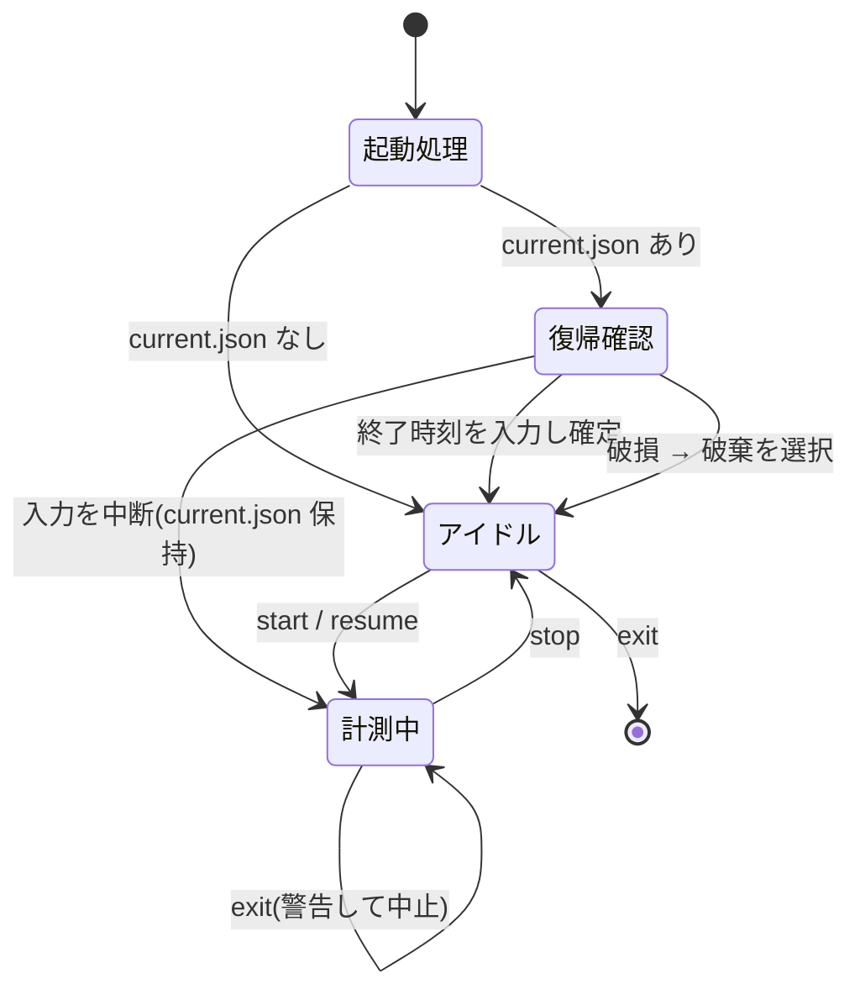

# プロジェクト用語集 (Glossary)

## 概要

このドキュメントは、timelog プロジェクトで使用される用語の定義を管理します。
**ここで定義した語彙をドキュメント・コード・コミットメッセージのすべてで使用します。**

日本語の概念に対する英語識別子が揺れると、ドキュメントとコードの対応が追えなくなります。
特に「表示連番」と「内部ID」は混同すると誤ったタスクを計測する事故に直結するため、
命名の統一を最優先とします（`docs/development-guidelines.md`「本プロジェクトの語彙」参照）。

**更新日**: 2026-08-12

## ドメイン用語

### timelog

**定義**: 作業時間の記録と集計を行う、ローカル完結の REPL 型ツール。本プロダクトの名称

**説明**:
Excel シートによる作業実績管理を置き換えることを目的とする。起動しっぱなしにして、
作業の切り替えごとにコマンドを打つ運用を前提としている。同期・サーバ・チーム共有は持たない。

**関連用語**: [REPL](#repl)、[エントリ](#エントリ)

**英語表記**: timelog

---

### プロジェクト

**定義**: 作業対象を束ねる最上位の単位。配下に複数のタスクを持つ

**説明**:
事前に `project add` で登録し、`use` で作業対象を切り替える。不変の[内部ID](#内部id)（`p_` 始まり）と
名前を持ち、[アーカイブ](#アーカイブ)状態を保持する。名前は全プロジェクト内で一意
（アーカイブ済みを含む）。

**関連用語**: [タスク](#タスク)、[アーカイブ](#アーカイブ)、[内部ID](#内部id)

**使用例**:
- 「プロジェクトを登録する」: `project add myproj`
- 「作業対象プロジェクトを切り替える」: `use myproj`

**データモデル**: `src/types/entities.ts` の `Project`

**英語表記**: Project（識別子: `project` / `projectId` / `projectName`）

---

### タスク

**定義**: プロジェクト配下に登録する作業の種類。計測の対象となる単位

**説明**:
`task add` で事前登録し、[表示連番](#表示連番)または名前の部分一致で指定する。
不変の[内部ID](#内部id)（`t_` 始まり）、名前、アーカイブ状態、`lastUsedAt`（最後に計測を開始した日時）を持つ。
名前は同一プロジェクト内で一意（アーカイブ済みを含む）。

**関連用語**: [プロジェクト](#プロジェクト)、[表示連番](#表示連番)、[最近使った順](#最近使った順)

**使用例**:
- 「タスクを登録する」: `task add 認証API実装`
- 「タスクを指定して計測を開始する」: `start 1` または `start 認証`

**データモデル**: `src/types/entities.ts` の `Task`

**英語表記**: Task（識別子: `task` / `taskId` / `taskName`）

---

### エントリ

**定義**: 確定した作業実績の 1 レコード。開始時刻・終了時刻・作業時間・プロジェクト・タスク・備考を持つ

**説明**:
`stop` によって確定し、`~/.timelog/entries/YYYY-MM.jsonl` に 1 行 1 レコードで追記される。
[日跨ぎ分割](#日跨ぎ分割)により、1 回の計測から複数のエントリが生成されることがある。

**プロジェクト・タスクを [内部ID](#内部id) と[名前のスナップショット](#名前のスナップショット)の
両方で保持する**のが本プロダクト固有の設計である。

**関連用語**: [内部ID](#内部id)、[名前のスナップショット](#名前のスナップショット)、[日跨ぎ分割](#日跨ぎ分割)、[計測中の状態](#計測中の状態)

**使用してはいけない別名**: レコード（record）、ログ（log）、アイテム（item）

**データモデル**: `src/types/entities.ts` の `Entry`

**英語表記**: Entry（識別子: `entry` / `entries`）

---

### 計測中の状態

**定義**: `start` から `stop` までの間、進行中の計測を表す状態。`~/.timelog/current.json` の存在と一致する

**説明**:
`start` の実行時点で即座にファイルへ書き出される。これにより REPL が異常終了しても
開始時刻を失わず、次回起動時の[復帰フロー](#復帰フロー)で計測を閉じられる。
`stop` の完了時に削除される。

**関連用語**: [復帰フロー](#復帰フロー)、[エントリ](#エントリ)、[終了フロー](#終了フロー)

**使用してはいけない別名**: アクティブ（active）、実行中（running）、セッション（session）

**データモデル**: `src/types/entities.ts` の `CurrentTimer`

**英語表記**: Current Timer（識別子: `current` / `CurrentTimer`）

---

### 内部ID

**定義**: プロジェクト・タスクに採番される不変の識別子。`p_3x8q1v` / `t_7h2k9m` の形式

**説明**:
登録時に一度だけ採番され、リネーム・アーカイブ・マスタの再編集によって変化しない。
[エントリ](#エントリ)からマスタへの参照は必ずこの ID で行う。

Crockford Base32（`i` `l` `o` `u` を除いた 32 文字）の 6 文字に、`p_` / `t_` のプレフィックスを付ける。
**数字始まりにしない**のは、[表示連番](#表示連番)との解釈の衝突を避けるためである。

**関連用語**: [表示連番](#表示連番)、[名前のスナップショット](#名前のスナップショット)

**使用してはいけない別名**: キー（key）、UID、裸の `id`

**実装箇所**: `src/domain/generateId.ts`

**英語表記**: Internal ID（識別子: `projectId` / `taskId`）

---

### 表示連番

**定義**: `task list` / `project list` の表示で各行に振られる 1 始まりの番号。コマンド引数でタスクを指定する際に使う

**説明**:
[最近使った順](#最近使った順)で整列した結果の添字 + 1 であり、**並び順が変われば番号も変わる**。
[内部ID](#内部id)とは無関係な、その場限りの表示上の番号である。

`show` の各行に振られる行番号も同種のもので、`edit` の対象指定に使う。

**関連用語**: [内部ID](#内部id)、[最近使った順](#最近使った順)、[タスク解決](#タスク解決)

**使用してはいけない別名**: ID（内部IDと紛れるため厳禁）

**識別子**: `index`（タスク一覧）/ `lineNo`（show の行番号）

---

### 名前のスナップショット

**定義**: エントリに記録される、記録時点のプロジェクト名・タスク名

**説明**:
[内部ID](#内部id)と併せてエントリに保持される冗長なデータ。参照の正はあくまで ID であり、
表示・出力時は ID から現在の名前を解決する。スナップショットは
`projects.json` を失った場合のフォールバックであり、JSONL を単体で `grep` できる性質の担保でもある。

**関連用語**: [内部ID](#内部id)、[名前解決](#名前解決)、[エントリ](#エントリ)

**使用してはいけない別名**: キャッシュ名（cachedName）、ラベル（label）

**識別子**: `projectName` / `taskName`

---

### 名前解決

**定義**: エントリの[内部ID](#内部id)からマスタを引き、現在のプロジェクト名・タスク名を得る処理

**説明**:
`show` と `export` が同じタスクに別の名前を表示しないよう、この処理は `NameResolver` の
1 コンポーネントに集約する。マスタから引けない場合は[名前のスナップショット](#名前のスナップショット)へ
フォールバックし、警告を表示する。

**関連用語**: [名前のスナップショット](#名前のスナップショット)、[内部ID](#内部id)

**実装箇所**: `src/services/NameResolver.ts`

**英語表記**: Name Resolution（識別子: `NameResolver` / `resolve`）

---

### タスク解決

**定義**: コマンド引数の文字列から、対象のタスクを一意に特定する処理

**説明**:
引数が数字のみなら[表示連番](#表示連番)、それ以外なら名前の部分一致として解釈する。
部分一致が複数件の場合は候補を提示して中止する。アーカイブ済みタスクは対象に含まれない。

**関連用語**: [表示連番](#表示連番)、[最近使った順](#最近使った順)、[アーカイブ](#アーカイブ)

**実装箇所**: `src/domain/resolveTask.ts`

**英語表記**: Task Resolution（識別子: `resolveTask`）

---

### 最近使った順

**定義**: タスク一覧の並び順。最後に計測を開始した日時（`lastUsedAt`）の降順

**説明**:
未使用タスク（`lastUsedAt` が `null`）は末尾に置き、同値の場合は登録日時の降順で並べる。
`lastUsedAt` は `start` の成功時にのみ更新し、[事後入力](#事後入力)では更新しない
（事後入力は思い出しての補正であり、直近の作業順序を表さないため）。

**この並び順を決める場所は `listTasks` 1 箇所のみ**とする。表示と[タスク解決](#タスク解決)で
別々に整列すると、両者がずれた瞬間に誤ったタスクを計測してしまう。

**関連用語**: [表示連番](#表示連番)、[タスク解決](#タスク解決)

**実装箇所**: `src/domain/byRecency.ts`

**英語表記**: Recency Order（識別子: `byRecency` / `lastUsedAt`）

---

### 日跨ぎ分割

**定義**: 計測区間が日付をまたぐ場合に、日付境界（00:00）ごとにエントリを複数に分割する処理

**説明**:
`stop` の時点で実行する。分割回数に上限を設けず、境界の数だけループで割る。
金曜夜から月曜朝まで `stop` を押し忘れた場合は 3 回以上に分割される。

**分割の前に開始・終了時刻を分単位へ切り捨てる**。日付境界は常に分の倍数のため、
分単位に揃った区間を割る限り各セグメントは整数分となり、分割後の合計が分割前と厳密に一致する。
セグメントごとに独立して秒を切り捨てると、誤差がセグメント数だけ累積して合計が合わなくなる。

**関連用語**: [エントリ](#エントリ)、[作業時間](#作業時間)

**使用してはいけない別名**: 分割（divide）、チャンク（chunk）

**実装箇所**: `src/domain/splitByDay.ts` / `src/domain/buildEntries.ts`

**英語表記**: Day Split（識別子: `splitByDay` / `segment`）

---

### 作業時間

**定義**: エントリの開始時刻から終了時刻までの経過時間。**分単位の整数**で保持する

**説明**:
分に切り捨てた開始時刻と終了時刻の差から算出する。0.5 時間単位などへの丸めは行わない
（個人用のため工数表向けの丸め配分が不要）。1 分未満の計測も 0 分のエントリとして記録し、破棄しない。

表示は `H:MM(N分)` の形式（例: `1:05(65分)`）。前者は感覚的な把握、後者は表計算への転記に使う。

**関連用語**: [日跨ぎ分割](#日跨ぎ分割)、[エントリ](#エントリ)

**識別子**: `minutes`

---

### アーカイブ

**定義**: プロジェクト・タスクを一覧表示と[タスク解決](#タスク解決)の対象から外す操作

**説明**:
完了したタスクが一覧に溜まると[表示連番](#表示連番)による選択の摩擦が増すため導入した。
**削除ではない**。アーカイブしても記録済みの[エントリ](#エントリ)は影響を受けず、
`show` / `export` に表示され続ける。`--all` オプションで一覧に含めて表示できる。

計測中のタスクはアーカイブできない。

**関連用語**: [タスク解決](#タスク解決)、[エントリ](#エントリ)

**使用してはいけない別名**: 削除（deleted）、非表示（hidden）、クローズ（closed）

**識別子**: `archived`

---

### 事後入力

**定義**: タイマーの押し忘れに対し、後から時刻を指定してエントリを追加する操作（`add` コマンド）

**説明**:
リアルタイム計測を主とし、押し忘れをこれで補うのが本プロダクトの基本コンセプトである。
既存エントリと時間帯が重複する場合も、警告を出したうえで追加を許可する
（禁止すると押し忘れの補正ができなくなるため）。

**関連用語**: [事後修正](#事後修正)、[最近使った順](#最近使った順)

**英語表記**: Manual Entry（コマンド: `add`）

---

### 事後修正

**定義**: 記録済みエントリの時刻・タスク・備考を後から修正する操作（`edit` コマンド）

**説明**:
対象は**直前に `show` で表示した日付**の[表示連番](#表示連番)（行番号）で指定する。
`show` で確認してから直すという実際の操作順に沿わせ、通常は日付の再入力を不要にしている。
日付を明示する場合は `edit <YYYY-MM-DD> <行番号> ...` とする。

修正は JSONL の該当行の書き換えとなるため、[原子的書き込み](#原子的書き込み)で実行する。

**関連用語**: [事後入力](#事後入力)、[原子的書き込み](#原子的書き込み)、[表示連番](#表示連番)

**英語表記**: Entry Edit（コマンド: `edit`）

---

### 備考

**定義**: エントリに付ける自由記述のテキスト

**説明**:
計測中は `note` コマンドで設定し、**複数回実行した場合は上書き**する（追記しない）。
記録後は `edit` で修正する。作業前には書けないことが多く、後から思い出すことも多いため、
この 2 つの入力経路を用意している。

設定されなかった場合はフィールド自体を持たない。CSV 出力時は列を固定し、値を空欄とする。
[日跨ぎ分割](#日跨ぎ分割)で生成された全エントリに同じ備考が複製される。

**関連用語**: [エントリ](#エントリ)、[事後修正](#事後修正)

**識別子**: `note`

---

### 終了フロー

**定義**: `exit`（および Ctrl-D）による REPL の終了処理

**説明**:
[計測中の状態](#計測中の状態)で終了しようとした場合、**警告を表示して終了を中止**し、
`stop` を促す。計測しっぱなしのまま終了すると記録が壊れるためである。

この仕様により、次項の[復帰フロー](#復帰フロー)が動くのは
クラッシュや強制終了で `current.json` が残ったケースに限られる。

**関連用語**: [復帰フロー](#復帰フロー)、[計測中の状態](#計測中の状態)

---

### 復帰フロー

**定義**: 起動時に `current.json` が残っていた場合に、終了時刻を対話的に尋ねて計測を確定させる処理

**説明**:
異常終了時の復帰導線。放置された計測を実態に合わせて閉じられる。
開始時刻より前の時刻が入力された場合は再入力を求める。
入力を中断した場合は `current.json` を保持したまま起動する（記録を失わないため）。

**関連用語**: [計測中の状態](#計測中の状態)、[終了フロー](#終了フロー)

**実装箇所**: `src/repl/recoverTimer.ts`

---

### ステアリングファイル

**定義**: 特定の開発作業における「今回何をするか」を記録する作業単位のドキュメント

**説明**:
`.steering/[YYYYMMDD]-[タスク名]/` に配置し、`requirements.md` / `design.md` / `tasklist.md` の
3 ファイルを持つ。git 管理外。命名は `20260812-implement-mvp-core` 形式。

**関連用語**: [永続ドキュメント](#永続ドキュメント)

**英語表記**: Steering File

---

### 永続ドキュメント

**定義**: `docs/` に置かれる、アプリケーション全体の「何を作るか」「どう作るか」を定義したドキュメント

**説明**:
PRD、機能設計書、技術仕様書、リポジトリ構造定義書、開発ガイドライン、用語集の 6 点。
頻繁に更新されず、プロジェクト全体の「北極星」として機能する。
実装と食い違った場合は、どちらが正しいかを判断してドキュメント側も更新する。

**関連用語**: [ステアリングファイル](#ステアリングファイル)

---

## 技術用語

### REPL

**正式名称**: Read-Eval-Print Loop

**定義**: 入力を読み取り、評価し、結果を表示することを繰り返す対話型の実行環境

**本プロジェクトでの用途**:
timelog のインターフェースそのもの。単発のサブコマンド CLI ではなく、起動しっぱなしにして
作業の切り替えごとにコマンドを打つ形を採る。CLI の起動コストを毎回払わないことが選定理由である。

**プロンプトに状態を表示する**ことで `status` 相当のコマンドを不要にしている:

```
[myproj] ▶ 認証API実装 00:23 >
```

**実装**: `src/repl/`、`node:readline/promises`

**関連ドキュメント**: [機能設計書](./functional-design.md#コンポーネント設計)

---

### JSONL

**正式名称**: JSON Lines

**定義**: 1 行に 1 つの JSON オブジェクトを書く、改行区切りのテキスト形式

**公式サイト**: https://jsonlines.org/

**本プロジェクトでの用途**:
[エントリ](#エントリ)の保存形式。`~/.timelog/entries/YYYY-MM.jsonl` に月別で保持する。

**選定理由**:
- 追記が O(1) で、既存行に触れないため書き込み中断で過去の記録を壊さない
- `grep` で直接読める。ローカル完結・プレーンテキストという方針に合う
- 項目を追加しても既存行は不足キーを持つだけで済み、一括移行が不要

**代替技術**: SQLite / lowdb（DB を挟むと単体での可読性を失うため不採用）

**関連ドキュメント**: [技術仕様書](./architecture.md#データ永続化戦略)

---

### TypeScript

**定義**: JavaScript に静的型付けを追加したプログラミング言語

**公式サイト**: https://www.typescriptlang.org/

**バージョン**: ~5.3.0

**本プロジェクトでの用途**:
全ソースコードを記述する。[エントリ](#エントリ)が[内部ID](#内部id)と
[名前のスナップショット](#名前のスナップショット)を両方持つ構造は、片方だけ書き忘れると
静かに壊れるため、コンパイル時に検出できることの価値が大きい。

**設定ファイル**: `tsconfig.json`

**注意**: `moduleResolution` を `NodeNext` とし、**相対 import に `.js` 拡張子を明示する**。
`bundler` のままだとビルドもテストも通るが実バイナリだけが起動しない。

---

### Vitest

**定義**: Vite ベースのテストフレームワーク

**公式サイト**: https://vitest.dev/

**バージョン**: ^2.0.0

**本プロジェクトでの用途**:
ユニット・統合・E2E のすべてのテストを実行する。カバレッジ閾値 80% を設定済み。

**設定ファイル**: `vitest.config.ts`

---

### Crockford Base32

**定義**: 人間が読み書きすることを想定した Base32 の変種。紛らわしい `i` `l` `o` `u` を文字集合から除外している

**本プロジェクトでの用途**:
[内部ID](#内部id)の生成に使用する。`i`/`l`/`1`、`o`/`0` の見間違いを避けるためであり、
`--with-id` の CSV や JSONL の直接閲覧など、ID を目視で扱う場面があることを想定している。

**文字集合**: `0123456789abcdefghjkmnpqrstvwxyz`（32 文字）

**実装箇所**: `src/domain/generateId.ts`

---

### 原子的書き込み

**定義**: 一時ファイルへ書き出してから `rename` で置換することで、書き込み中断時にも既存ファイルが壊れないようにする手法

**説明**:
`rename` は同一ファイルシステム内で原子的に動作する。一時ファイルは**対象と同じディレクトリ**に作る
（`/tmp` を経由すると別ファイルシステムになり得て、原子性が失われる）。

`projects.json` / `current.json` の保存と、`edit` による月ファイルの書き換えに使う。
`stop` によるエントリ追記は `appendFile` を使い、既存行に一切触れない。

**実装箇所**: `src/stores/atomicWrite.ts`

**英語表記**: Atomic Write（識別子: `atomicWrite`）

---

### CSV インジェクション

**定義**: `=` `+` `-` `@` で始まるセルが表計算ソフトで数式として解釈される問題

**本プロジェクトでの対策**:
CSV 出力時、該当するセルの先頭に `'` を付与する。[備考](#備考)やタスク名はユーザー自身の入力だが、
Excel で開いた際に数式化すると値が壊れるため。

**実装箇所**: `src/domain/toCsv.ts`

---

### East Asian Width

**定義**: Unicode 文字の東アジア圏における表示幅の区分。全角/半角の判別に用いる

**本プロジェクトでの用途**:
`show` のテーブル表示で列幅を揃えるため、文字数ではなく表示桁数（全角 2 桁・半角 1 桁）で計算する。
日本語のタスク名を含むため、文字数で揃えると列がずれる。

**実装箇所**: `src/formatters/displayWidth.ts`

---

## 略語・頭字語

### PRD

**正式名称**: Product Requirements Document

**意味**: プロダクト要求定義書。「何を作るか」を定義する

**本プロジェクトでの使用**: `docs/product-requirements.md`

---

### MVP

**正式名称**: Minimum Viable Product

**意味**: 実用最小限の製品。プロダクトとして成立する最小の機能セット

**本プロジェクトでの定義**:
「1 日の作業実績を、リアルタイム計測だけで正しく記録し、その日のうちに見返せる」状態。
[事後入力](#事後入力)・[事後修正](#事後修正)・[アーカイブ](#アーカイブ)・CSV 出力は次の段階に置く。

**関連**: [優先度](#優先度)

---

### CLI

**正式名称**: Command Line Interface

**意味**: コマンドラインから操作するインターフェース

**本プロジェクトでの使用**:
timelog は CLI ツールに分類されるが、**単発のサブコマンド形式ではなく [REPL](#repl) 形式**である。
`timelog` で起動し、以降は REPL 内でコマンドを打つ。

---

### ESM

**正式名称**: ECMAScript Modules

**意味**: JavaScript の標準モジュール形式（`import` / `export`）

**本プロジェクトでの使用**:
`package.json` の `"type": "module"` により全体で採用。
Node.js の ESM では**相対 import に拡張子が必須**である点に注意。

---

### TSDoc

**正式名称**: TypeScript Documentation Comments

**意味**: TypeScript 向けのドキュメントコメント記法（`/** ... */`）

**本プロジェクトでの使用**:
公開関数・クラスに記述する。特に「なぜその実装なのか」を残す
（例: [日跨ぎ分割](#日跨ぎ分割)で分割前に分単位へ切り捨てる理由）。

---

## アーキテクチャ用語

### レイヤードアーキテクチャ

**定義**: システムを役割ごとに層に分割し、上位層から下位層への一方向の依存関係を持たせる設計パターン

**本プロジェクトでの適用**:

```
REPL レイヤー (src/repl/)
    ↓
サービスレイヤー (src/services/)  →  純粋ロジック (src/domain/)
    ↓
データレイヤー (src/stores/)
```

| レイヤー | 責務 | 依存可能 |
|---------|------|---------|
| REPL | 入力受付・パース・表示・終了/復帰フロー | services, formatters, validators, types |
| サービス | 永続化を伴うビジネス処理の調整 | domain, stores, types |
| 純粋ロジック | 副作用のない計算 | types, formatters |
| データ | ファイル I/O・パーミッション・原子性 | types |

**禁止される依存**: `stores → services`、`services → repl`、`domain → stores`、`repl → stores`

**メリット**: サービス層が REPL を起動せずテストできる。純粋ロジックがファイルシステムなしでテストできる

**関連ドキュメント**: [技術仕様書](./architecture.md#アーキテクチャパターン)、[リポジトリ構造定義書](./repository-structure.md#依存関係のルール)

---

### 純粋ロジック層 (domain)

**定義**: 副作用（ファイル I/O、現在時刻の取得、コンソール出力）を持たない計算のみを置く層

**本プロジェクトでの適用**:
[日跨ぎ分割](#日跨ぎ分割)、[タスク解決](#タスク解決)、[内部ID](#内部id)の採番、日次集計、CSV 生成を配置する。

**サービス層と分ける理由**:
本プロダクトで最も壊れやすいのは日跨ぎ分割とタスク解決であり、いずれも入力と出力が決まれば
正しさが定義できる。I/O を持つサービスから物理的に分離することで、
**テストがファイルシステムも時刻モックも必要としない**状態を構造的に保証する。

**実装箇所**: `src/domain/`

---

### Result 型

**定義**: 成功と失敗を型で表現する判別可能ユニオン。例外の代わりに戻り値でエラーを伝える

**本プロジェクトでの適用**:

```typescript
type Result<T, E = AppError> =
  | { ok: true; value: T }
  | { ok: false; error: E };
```

サービスレイヤーは想定内のエラー（タスクが見つからない、計測していない、時刻が不正）を
`Result` で返す。これらは制御フローの一部であって異常ではない。

**メリット**: REPL レイヤーの `switch` にケース漏れがあれば型検査で落ちる。
「エラーメッセージは何が問題かと次に何をすべきかの両方を含む」という要件の網羅性を、
コンパイラが保証できる

**例外を使う場面**: ファイル I/O エラー、`projects.json` の破損など、プログラムが対処できない事象のみ

**実装箇所**: `src/types/result.ts`

---

### 時刻の注入

**定義**: 現在時刻をサービス内部で取得せず、引数として渡す設計

**本プロジェクトでの適用**:
`TimerService.start(projectId, taskId, note, now: Date)` のように、
現在時刻の取得は REPL レイヤーの責務とする。

**理由**: [日跨ぎ分割](#日跨ぎ分割)の正しさは「金曜夜から月曜朝までの計測が 3 分割される」といった
時刻依存のシナリオでしか検証できない。サービス内部で `new Date()` を呼ぶと、
テストがシステムクロックのモックに依存し、並列実行時に不安定になる

**関連**: [開発ガイドライン](./development-guidelines.md#プロジェクト固有の必須ルール) の必須ルール 1

---

## ステータス・状態

### REPL の状態

**定義**: REPL が取りうる状態。[計測中の状態](#計測中の状態)（= `current.json` の存在）を軸とする

| 状態 | 意味 | 遷移条件 | 次の状態 |
|------|------|---------|---------|
| 起動処理 | データディレクトリ生成・マスタ読み込み | 起動時 | 復帰確認 / アイドル |
| 復帰確認 | `current.json` が残っていた場合の終了時刻入力 | `current.json` あり | アイドル / 計測中 |
| アイドル | 計測していない状態 | `stop` / 復帰の確定 | 計測中 / 終了 |
| 計測中 | 計測が進行中。プロンプトに ▶ と経過時間を表示 | `start` / `resume` / 復帰の中断 | アイドル |

**状態遷移図**:



---

### 優先度

**定義**: 機能の実装順序を示す 3 段階の区分

| 値 | 意味 | 本プロジェクトでの対象 |
|----|------|---------------------|
| P0 | 必須。[MVP](#mvp) に含める。これがないとプロダクトとして成立しない | マスタ管理、タスク解決、start/stop/resume、プロンプト、note、永続化と日跨ぎ分割、show、終了/復帰フロー、help |
| P1 | 重要。初期リリース後すぐに追加する | 事後入力、事後修正、アーカイブ、CSV エクスポート |
| P2 | できれば。将来的に検討する | 週次/月次サマリ、タスクのテンプレート化、長時間計測のリマインド、`export --with-id` |

**関連ドキュメント**: [PRD](./product-requirements.md#機能要件)

---

## データモデル用語

### Project

**定義**: [プロジェクト](#プロジェクト)のデータ構造

**主要フィールド**:
- `id`: [内部ID](#内部id)（`p_` + Base32 6 文字）
- `name`: 名前（1-100 文字、全体で一意）
- `archived`: [アーカイブ](#アーカイブ)状態
- `createdAt`: 登録日時
- `tasks`: 配下の [Task](#task) 配列

**制約**: 名前はアーカイブ済みを含めて一意。ID は不変

**実装箇所**: `src/types/entities.ts`

---

### Task

**定義**: [タスク](#タスク)のデータ構造

**主要フィールド**:
- `id`: [内部ID](#内部id)（`t_` + Base32 6 文字）
- `name`: 名前（1-100 文字、同一プロジェクト内で一意）
- `archived`: [アーカイブ](#アーカイブ)状態
- `createdAt`: 登録日時
- `lastUsedAt`: 最後に計測を開始した日時（[最近使った順](#最近使った順)の並び替えキー、未使用は `null`）

**関連エンティティ**: [Project](#project) に内包される

**実装箇所**: `src/types/entities.ts`

---

### Entry

**定義**: [エントリ](#エントリ)のデータ構造

**主要フィールド**:
- `date`: ローカル日付（`YYYY-MM-DD`）
- `start` / `end`: ローカルオフセット付き ISO 8601（秒精度）
- `minutes`: [作業時間](#作業時間)（分単位の整数）
- `projectId` / `taskId`: [内部ID](#内部id)（参照の正）
- `projectName` / `taskName`: [名前のスナップショット](#名前のスナップショット)
- `note`: [備考](#備考)（設定時のみ存在）

**制約**: 物理的な外部キー制約を持たない（JSONL のため）。整合性はアプリケーション側で担保し、
解決に失敗した場合はスナップショット名へフォールバックする

**実装箇所**: `src/types/entities.ts`

---

### CurrentTimer

**定義**: [計測中の状態](#計測中の状態)のデータ構造

**主要フィールド**:
- `projectId` / `projectName` / `taskId` / `taskName`: 計測対象
- `start`: 計測開始時刻
- `note`: [備考](#備考)（`note` コマンドで上書き）

**制約**: ファイルの存在自体が「計測中である」ことを意味する

**実装箇所**: `src/types/entities.ts`

---

## エラー・例外

### AppError

**定義**: サービスレイヤーが [Result 型](#result-型)で返す想定内エラーの判別可能ユニオン

**主な種別**:

| `kind` | 発生条件 | ユーザーへの表示 |
|--------|---------|-----------------|
| `NoProjectSelected` | プロジェクト未選択で `task add` / `start` | `プロジェクトが選択されていません。'use <プロジェクト名>' で選択してください` |
| `ProjectNotFound` | `use` に未登録の名前 | `プロジェクト 'foo' は登録されていません。登録済み: ...` |
| `DuplicateName` | 既存名での `project add` / `task add` | `タスク '...' は既に登録されています。'task list' で確認してください` |
| `IndexOutOfRange` | [表示連番](#表示連番)が範囲外 | `番号 99 は範囲外です。1〜3 の番号か、タスク名の一部を指定してください` |
| `NotFound` | 名前の部分一致が 0 件 | `'...' に一致するタスクがありません。'task list' で一覧を確認してください` |
| `Ambiguous` | 名前の部分一致が 2 件以上 | 候補を番号付きで提示 |
| `NotMeasuring` | 非計測時の `stop` / `note` | `計測していません。'start <番号\|名前>' で開始してください` |
| `NoResumeTarget` | 確定エントリが 0 件での `resume` | `再開できるエントリがありません。...` |
| `InvalidTimeRange` | 終了時刻 < 開始時刻 | `終了時刻(09:00)が開始時刻(10:00)より前です。...` |
| `InvalidName` | 名前の長さ違反 / 制御文字 | `タスク名は 1〜100 文字で指定してください` |

**対処方法**:
- ユーザー: メッセージ末尾に示されたコマンドを実行する
- 開発者: 新しい `kind` を追加した際は、REPL レイヤーの `switch` に対応を追加する（漏れは型検査で検出される）

**実装箇所**: `src/types/errors.ts`

---

### DataCorruptedError

**クラス名**: `DataCorruptedError`

**継承元**: `Error`

**発生条件**: `projects.json` / `current.json` の JSON パースに失敗した場合

**対処方法**:
- `current.json` の場合: 内容を提示し、破棄するかをユーザーに確認する
- `projects.json` の場合: **起動を中止する**。マスタが読めない状態で新規登録を行うと、
  空の状態から上書きして既存の[内部ID](#内部id)体系を失う危険があるため

**ログレベル**: ERROR

**実装箇所**: `src/types/errors.ts`

**使用例**:
```typescript
throw new DataCorruptedError(
  'projects.json が破損しています',
  path,
  rawContent
);
```

---

### 破損行のスキップ

**定義**: JSONL の 1 行がパースできない場合に、その行のみを読み飛ばして処理を継続する挙動

**説明**:
例外を投げない。他の行の読み取りに影響させないことが JSONL を採用した利点であるため、
該当行を無視して警告を表示する（`警告: 2026-08.jsonl の 12 行目を読み飛ばしました(不正なJSON)`）。

**ログレベル**: WARN

**実装箇所**: `src/stores/EntryStore.ts`

---

## 計算・アルゴリズム

### 日跨ぎ分割の計算

**定義**: 計測区間を日付境界で分割し、分割後の[作業時間](#作業時間)の合計が分割前と厳密に一致することを保証する計算

**手順**:

```
1. 開始時刻・終了時刻を分単位へ切り捨てる
2. cursor = 開始時刻
3. cursor < 終了時刻 である間:
     boundary = cursor の翌日 00:00:00
     segEnd = min(boundary, 終了時刻)
     セグメント {cursor, segEnd} を追加
     cursor = segEnd
4. 各セグメントの minutes = (segEnd - segStart) / 60000
```

**なぜ先に切り捨てるか**: 日付境界は常に分の倍数である。分単位に揃った区間を分単位の境界で割る限り、
各セグメントは必ず整数分となり、合計が厳密に一致する。
セグメントごとに独立して秒を切り捨てると、誤差が (セグメント数 − 1) 分まで累積する。

**実装箇所**: `src/domain/splitByDay.ts` / `src/domain/buildEntries.ts`

**例**:

| 入力 | セグメント数 | 各セグメント | 合計 |
|------|------------|-------------|------|
| 08/12 09:12:30 → 08/12 10:17:45 | 1 | 65 | 65 分 |
| 08/12 23:30 → 08/13 00:20 | 2 | 30 + 20 | 50 分 |
| 08/14 18:00 → 08/17 09:00 | 4 | 360 + 1440 + 1440 + 540 | 3780 分 |
| 08/31 22:00 → 09/01 01:00 | 2 | 120 + 60 | 180 分（月をまたいで振り分け） |
| 08/12 09:00:10 → 08/12 09:00:50 | 1 | 0 | 0 分（破棄しない） |

---

### タスク別小計の集約

**定義**: `show` が表示する、プロジェクト・タスクごとの[作業時間](#作業時間)の合計

**計算方法**:

```
集約キー = `${entry.projectId} ${entry.taskId}`
```

**名前ではなく[内部ID](#内部id)で束ねる**。名前で集約すると、リネーム前後のエントリや、
[名前のスナップショット](#名前のスナップショット)へフォールバックしたエントリが別行に割れてしまう。
小計の意味は「同じタスクの合計」であり、それは ID で定義される。

並び順は合計時間の降順。

**実装箇所**: `src/domain/summarize.ts`

---

## 索引

### あ行
- [アーカイブ](#アーカイブ) — ドメイン用語
- [エントリ](#エントリ) — ドメイン用語
- [ESM](#esm) — 略語

### か行
- [計測中の状態](#計測中の状態) — ドメイン用語
- [glossary（用語集）](#概要) — 本ドキュメント
- [Crockford Base32](#crockford-base32) — 技術用語
- [原子的書き込み](#原子的書き込み) — 技術用語
- [CSV インジェクション](#csv-インジェクション) — 技術用語
- [CLI](#cli) — 略語

### さ行
- [作業時間](#作業時間) — ドメイン用語
- [事後入力](#事後入力) — ドメイン用語
- [事後修正](#事後修正) — ドメイン用語
- [終了フロー](#終了フロー) — ドメイン用語
- [純粋ロジック層](#純粋ロジック層-domain) — アーキテクチャ用語
- [ステアリングファイル](#ステアリングファイル) — ドメイン用語

### た行
- [タスク](#タスク) — ドメイン用語
- [タスク解決](#タスク解決) — ドメイン用語
- [タスク別小計の集約](#タスク別小計の集約) — アルゴリズム
- [timelog](#timelog) — ドメイン用語
- [TypeScript](#typescript) — 技術用語
- [TSDoc](#tsdoc) — 略語

### な行
- [内部ID](#内部id) — ドメイン用語
- [名前解決](#名前解決) — ドメイン用語
- [名前のスナップショット](#名前のスナップショット) — ドメイン用語
- [日跨ぎ分割](#日跨ぎ分割) — ドメイン用語
- [日跨ぎ分割の計算](#日跨ぎ分割の計算) — アルゴリズム

### は行
- [備考](#備考) — ドメイン用語
- [表示連番](#表示連番) — ドメイン用語
- [復帰フロー](#復帰フロー) — ドメイン用語
- [プロジェクト](#プロジェクト) — ドメイン用語
- [PRD](#prd) — 略語

### ま行
- [MVP](#mvp) — 略語

### や行
- [優先度](#優先度) — ステータス
- [永続ドキュメント](#永続ドキュメント) — ドメイン用語

### ら行
- [レイヤードアーキテクチャ](#レイヤードアーキテクチャ) — アーキテクチャ用語
- [Result 型](#result-型) — アーキテクチャ用語
- [REPL](#repl) — 技術用語
- [REPL の状態](#repl-の状態) — ステータス

### A-Z / その他
- [AppError](#apperror) — エラー
- [CurrentTimer](#currenttimer) — データモデル
- [DataCorruptedError](#datacorruptederror) — エラー
- [East Asian Width](#east-asian-width) — 技術用語
- [Entry](#entry) — データモデル
- [JSONL](#jsonl) — 技術用語
- [Project](#project) — データモデル
- [Task](#task) — データモデル
- [Vitest](#vitest) — 技術用語
- [時刻の注入](#時刻の注入) — アーキテクチャ用語
- [破損行のスキップ](#破損行のスキップ) — エラー

## 変更履歴

| 日付 | 変更内容 |
|------|---------|
| 2026-08-12 | 初版作成。PRD・機能設計書・技術仕様書・リポジトリ構造定義書・開発ガイドラインから用語を抽出 |
